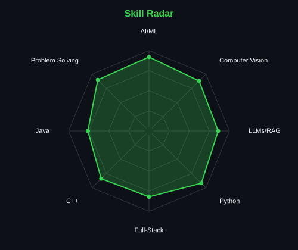
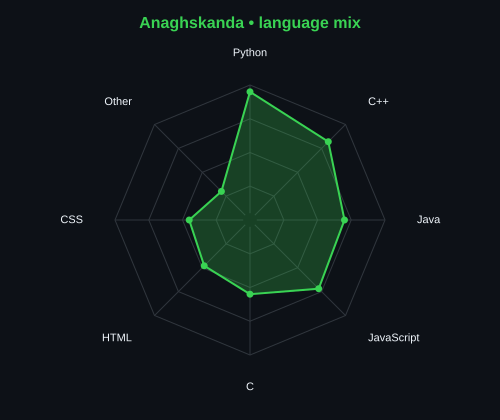
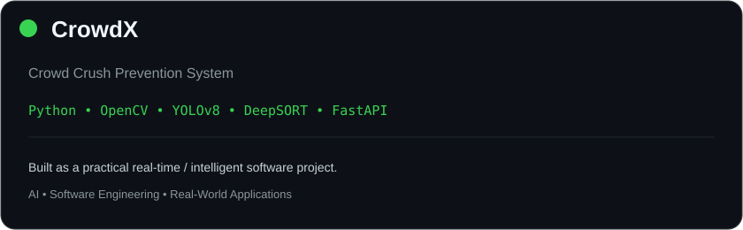
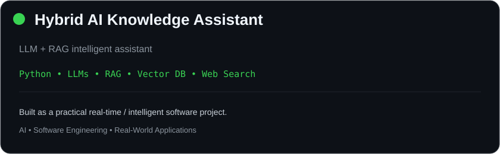
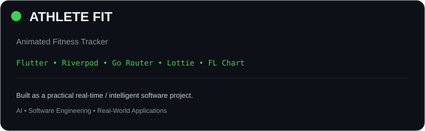
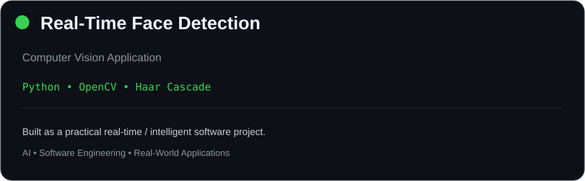

<div align="center">

<!-- PORTRAIT -->
<picture>
  <source media="(prefers-color-scheme: dark)" srcset="assets/portrait.svg">
  <source media="(prefers-color-scheme: light)" srcset="assets/portrait.svg">
  
</picture>

<br>

<!-- NAME / TAGLINE -->
<a href="https://github.com/Anagh-007">
  
</a>

<br>

<a href="https://linkedin.com/in/r-anaghskandabharadwaj-7591a2380"></a>
<a href="mailto:bharadwajanaghskanda@gmail.com"></a>
<a href="https://github.com/Anagh-007"></a>

<br><br>


</div>

---

## `~/` whoami

```console
$ cat about.txt
```

Hi, I'm **R Anaghskanda Bharadwaj**. I'm a Computer Science Engineering student interested in
**Artificial Intelligence, Machine Learning, Full-Stack Development, Generative AI, and Computer Vision**.

I enjoy building things that combine intelligent systems with practical software engineering.

- Currently building **AI/ML, Computer Vision & Full-Stack projects**
- Exploring **LLMs, RAG, AI Agents & Generative AI**
- Working with **Python, C, C++, Java, JavaScript, React & Node.js**
- Building real-time systems using **YOLOv8, OpenCV, DeepSORT & FastAPI**
- Interested in **AI Engineering, Software Engineering & Intelligent Systems**
- Fun fact: **I like turning real-world problems into working software.**

<br>

<div align="center">

## `~/` toolbox


</div>

---

<div align="center">

## `~/` skill radar

<table>
<tr>
<td width="50%" align="center" valign="middle">

<picture>
  <source media="(prefers-color-scheme: dark)" srcset="assets/radar-dark.svg">
  <source media="(prefers-color-scheme: light)" srcset="assets/radar-light.svg">
  
</picture>

</td>
<td width="50%" align="center" valign="middle">

<picture>
  <source media="(prefers-color-scheme: dark)" srcset="assets/radar-langs-dark.svg">
  <source media="(prefers-color-scheme: light)" srcset="assets/radar-langs-light.svg">
  
</picture>

</td>
</tr>
</table>

</div>

---

<div align="center">

## `~/` contribution calendar


<br><br>

<picture>
  <source media="(prefers-color-scheme: dark)" srcset="https://raw.githubusercontent.com/Anagh-007/Anagh-007/output/snake-dark.svg">
  <source media="(prefers-color-scheme: light)" srcset="https://raw.githubusercontent.com/Anagh-007/Anagh-007/output/snake.svg">
  
</picture>

</div>

---

<div align="center">

## `~/` the numbers

<picture>
  <source media="(prefers-color-scheme: dark)" srcset="https://github-readme-stats.vercel.app/api?username=Anagh-007&show_icons=true&theme=github_dark&hide_border=true&rank_icon=github">
  <source media="(prefers-color-scheme: light)" srcset="https://github-readme-stats.vercel.app/api?username=Anagh-007&show_icons=true&theme=default&hide_border=true&rank_icon=github">
  
</picture>

<br>


<br><br>


</div>

---

<div align="center">

## `~/` selected work

<table>
<tr>
<td width="50%">

<a href="https://github.com/Anagh-007">
<picture>
  <source media="(prefers-color-scheme: dark)" srcset="assets/card-crowdx-dark.svg">
  <source media="(prefers-color-scheme: light)" srcset="assets/card-crowdx-light.svg">
  
</picture>
</a>

</td>
<td width="50%">

<a href="https://github.com/Anagh-007">
<picture>
  <source media="(prefers-color-scheme: dark)" srcset="assets/card-ai-assistant-dark.svg">
  <source media="(prefers-color-scheme: light)" srcset="assets/card-ai-assistant-light.svg">
  
</picture>
</a>

</td>
</tr>

<tr>
<td width="50%">

<a href="https://github.com/Anagh-007">
<picture>
  <source media="(prefers-color-scheme: dark)" srcset="assets/card-athlete-fit-dark.svg">
  <source media="(prefers-color-scheme: light)" srcset="assets/card-athlete-fit-light.svg">
  
</picture>
</a>

</td>
<td width="50%">

<a href="https://github.com/Anagh-007">
<picture>
  <source media="(prefers-color-scheme: dark)" srcset="assets/card-face-detection-dark.svg">
  <source media="(prefers-color-scheme: light)" srcset="assets/card-face-detection-light.svg">
  
</picture>
</a>

</td>
</tr>
</table>

<sub>

| project | stack |
|---|---|
| **CrowdX – Crowd Crush Prevention System** | `Python` `OpenCV` `YOLOv8` `DeepSORT` `FastAPI` `NumPy` `Twilio` |
| **Hybrid AI Knowledge Assistant** | `Python` `LLMs` `RAG` `Vector DB` `Web Search API` |
| **ATHLETE FIT – Animated Fitness Tracker** | `Flutter` `Riverpod` `Go Router` `Lottie` `FL Chart` |
| **Real-Time Face Detection** | `Python` `OpenCV` `Haar Cascade` |

</sub>

</div>

---

<div align="center">

## `~/` languages & technologies


<br><br>

`Overleaf` · `LaTeX` · `SQL` · `FastAPI` · `OpenCV` · `YOLOv8`
· `DeepSORT` · `RAG` · `LLMs` · `Vector Databases`

</div>

---

<div align="center">

## `~/` interests

`Artificial Intelligence` · `Machine Learning` · `Computer Vision` · `Generative AI`
· `LLMs` · `RAG` · `AI Agents` · `Full-Stack Development`
· `Software Engineering` · `Real-Time Systems`

</div>

---

<div align="center">

<sub>`01100010 01110101 01101001 01101100 01100100 00100000 01101100 01100101 01100001 01110010 01101110 00100000 01110010 01100101 01110000 01100101 01100001 01110100`</sub>

</div>
